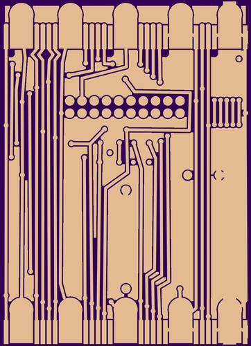
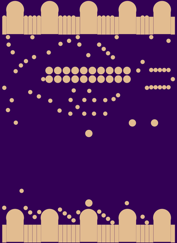

# micro:bit badge

This is ~~a super secret,~~ open source project to design a PCB badge for [Make Zurich 2017](https://makezurich.ch).

## How to use
The badge is an extension board to the [BBC micro:bit](https://www.microbit.co.uk). It's intended to be a 'bolt-and-go' extension board, saving the need for the awkward edge connector normally used to extend the micro:bit. The board must be connected on the top side of the micro:bit, because the small back pads are NOT connected.

To use, simply place on the top side of the micro:bit, and bolt it real tight.
Then, use the micro:bit as usual.

### Features
  * Breaks out all 20 pins into a standard 2.54mm 2x10 pin header area.
  * Routes all pins to an identical edge connector at the bottom to allow stacking more boards or plug to the edge connector.
  * Parts:
    * [Buzzer](https://www.aliexpress.com/item/Passive-Buzzer-AC-12MM-8-5MM-12085-16R-Resistance-3V-5V-12V-In-Common-Use-10PCS/1922801747.html) on the front side.
    * [CR2450 battery](https://www.aliexpress.com/item/Free-shipping-Hot-selling-5x-cell-button-coin-battery-CR2450-2450-ECR2450-KCR2450-5029LC-LM2450-lithium/32560745414.html).
    * [CR2450 battery holder](https://www.aliexpress.com/item/100Pcs-Horizontal-Through-Hole-CR2450-Coin-Button-Cell-Lithium-Battery-Case-Holder-Box-Base-Socket/32772425916.html) on the back side.
    * 5x M3 [Nuts](https://www.aliexpress.com/item/100pcs-lot-6MM-hollow-M3-copper-double-pass-six-corner-pillars-isolation-column/32701040166.html) and [Bolts](https://www.aliexpress.com/item/100PCS-LOT-5-6-Copper-Pillars-10MM-Height-M3-Thread-6-mm/32702087632.html).

### micro:bit badge in Make Zurich 2017
During preparations for the [Make Zurich 2017 hackathon](https://makezurich.ch), we noticed that it would be hard for teams to split the content of their hardware kits after the event was completed; so the idea of a hadrware badge that is actually useful for attendees to bring home was born.

We brainstormed different ideas, and eventually settled on using the micro:bit as the microcontroller of our badge, mainly due to the form factor, the LED matrix and the low cost. We started building designs in the organization team, and bouncing ideas back and forth with the micro:bit community until we reached an idea we liked.

The process of designing a badge is not that complicated, but the logistics involved were trickier than expected.

We ordered a first test batch on [PCBWay](http://www.pcbway.com/). About a week later, we had it in our hands but we found a bug, so we rushed to fix it and ordered a second test batch. While waiting for it to arrive, we noticed that Chinese New Year was going to get in our way, and it would delay the production past the dates of our event! We had just enough time to receive the second batch, test and -assuming everything was alright- place the final order. Luckily, the second batch had no issues, and we placed the final order immediately. But due to the requested quantity, the production time was more than what would fit before Chinese New Year, so we had to wait until 3AM due to the time zone differences for a PCBWay operator to go online and agree how to do it.

We received the final order on time, but the battery holders were delayed, so we had to place an emergency order on Digikey to replace them. Finally, during the open lab week, we had all the pieces ready to start mass production! Here's [@tamberg](https://twitter.com/tamberg) and [@gnz](https://twitter.com/gnz) soldering the bits and pieces:

And together with [@ursmii](https://twitter.com/ursmii), [@rac2030](https://github.com/rac2030) and [@h0l0gram](https://github.com/h0l0gram) we finished soldering, coding, flashing and screwing everything just in time for hackathon!

We had the idea giving the badge two basic features:
 - A playful one: to enable a ripple/firefly effect with badges around you when pressing a button.
 - An informational one: to send messages from the organizing team to everyone.

And of course, being an open platform, it was expected that attendees would hack the badge and flash it with their own code!

The code for the badge was developed by Urs, you can find it here: https://github.com/urs8000/micro-bit_badge

Here's the badge in use:

## Board renders

The renders are courtesy of [OSH Park](https://oshpark.com).

### Board top & bottom
 

### Top & bottom copper layers
 

### Top & bottom solder marks
 

## Credits
Thanks to [Urs Marti](https://github.com/urs8000/) and [Owen Brotherhood](https://github.com/OwenBrotherwood) for all the support during the development of this board.
